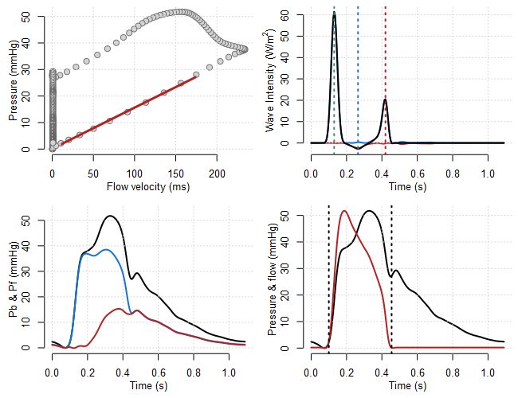

# Wave intensity/separation analysis in R

The function herein separates a pressure and flow wave (sampled at 200hz) into its forward and backward traveling components via an R implementation of wave intensity/separation analysis.

Load function:
```R
devtools::source_url("https://raw.githubusercontent.com/mkarmstrong/WaveIntensity/main/WaveIntensity4.R")
```


Run function:
```R
ans <- WaveIntensity4(mydata$pressure, 
                      mydata$flow, 
                      align = FALSE)
```

Set `align = TRUE` if presure and flow curves require time alingment.
<br/><br/>

The function returns the following values:

**Variable**      | **Description**
------------------|-------------------------
tmaxp             | Time to max pressure
wi1               | Peak forward net WI
wit1              | Time to wi1
wia1              | Area under wi1
wi0               | Peak backward net WI
wit0              | Time to wi0
wia0              | Area under wi0
wi2               | Second peak net WI
wit2              | Time to wi2
wia2              | Area under wi2
wrm               | wave reflection magnitude wia0/wia1
zc                | Character impedance (PU loop)
zcss              | Character impedance (Sum of squares)
comp              | Compliance (PU loop)
compss            | Compliance (sum of squares)
pbmax             | Peak backward pressure
intpb             | Integral of Pb
pbt               | Time to pbmax
pfmax             | Peak forward pressure
intpf             | Integral of Pf
pft               | time to pfmax
rm                | Reflection magnitude (pbmax/pfmax)
ri                | Resistance index

<br/><br/>

Results will also be sent to the plot tab for inspection:



Enjoy!
