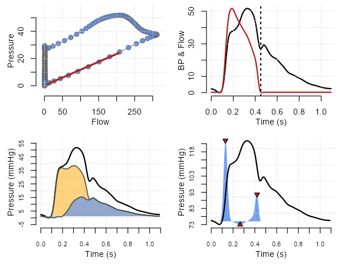

# Wave intensity/separation analysis in R

The function herein separates the pressure wave (requires simultaneously measured pressure and flow waves sampled at 200hz) into forward and backward traveling components via an R implementation of wave intensity/separation analysis.

Load function:
```R
devtools::source_url("https://raw.githubusercontent.com/mkarmstrong/WaveIntensity/main/WaveIntensity4.R")
```


Run function:
```R
ans <- WaveIntensity4(mydata$pressure, 
                      mydata$flow, 
                      align = FALSE)
```

Set `align = TRUE` if presure and flow curves require time alignment.
<br/><br/>

The function returns the following values:

**Variable**      | **Description**
------------------|-------------------------
sbp               | Systolic BP
Tsbp              | Time to systolic BP
dbp               | Diastolic BP
Tdbp              | Time to diastolic BP
p1                | BP at p1
Tp1               | Time to p1
p2                | BP at p2
Tp2               | Time to p2
ed                | BP at incisura
Ted               | Ejection duration
p3                | BP at incisura peak
Tp3               | Time to incisura peak
Aix               | Augmentation index
qmax              | Peak flow
Tqmax             | Time to peak flow
qfoot             | Flow at end diastole
qmean             | Mean flow
wi1               | Peak forward compresion wave
Twi1              | Time to peak FCW
Awi1              | Area under FCW
wi0               | Peak backward compresion wave
Twi0              | Time to peak BCW
Awi0              | Area under BCW
wi2               | Peak forward decompresion wave
Twi2              | Time to peak FDW
Awi2              | Area under FDW
wrm               | Wave reflection magnitude
zc                | Characteristic impedance (pu loop)
zcss              | Characteristic impedance (sum of squares)
comp              | Arterial complience (pu loop)
compss            | Arterial complience (sum of squares)
pfmax             | Peak forward BP
Tpfmax            | Time to peak Pf
Apf               | Area under Pf
pbmax             | Peak backward BP         
Tpbmax            | Time to peak Pb
Apb               | Area under Pb
rm                | Reflection magnitude
ri                | Resistance index

<br/><br/>

Results will also be sent to the plot tab for inspection:



Enjoy!
